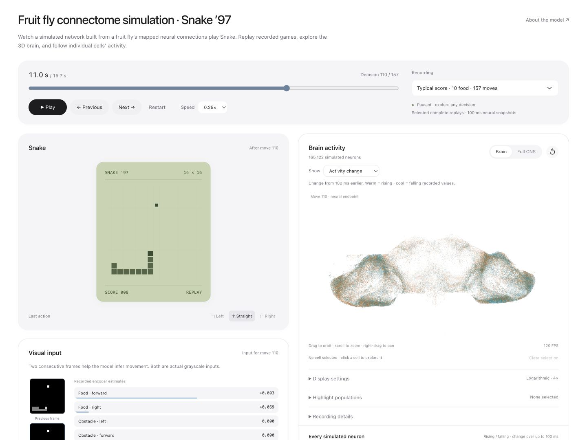

# Fruit Fly Brain Snake

Explore recorded Snake games alongside the activity of a simulated neural network built from a fruit fly's mapped connections. Rotate the brain, inspect individual cells, highlight populations, and compare activity across decisions.

[How the model works](docs/model.md) · [Results and limitations](docs/results.md) · [Research source guide](model/README.md)

This is an anatomy-constrained engineering experiment with learned visual and action interfaces. It is not a recording of a living fly, a biologically validated brain emulation, or evidence that every simulated cell is necessary for the task. The website replays saved activity; it does not train or execute the policy.



This source release includes no hosted demo URL or default data-download host.

## Run the viewer

Requires **Python 3.10+** and a modern browser with WebGL. No Python packages, Node installation, GPU, account, or API key are needed to view the recordings.

```sh
python3 scripts/serve.py
```

Open **http://127.0.0.1:8802/**. Replay data must already be cached, or a data host must be configured through `FRUIT_FLY_DATA_URL`. No download host is supplied in this release. An existing cache can be supplied with `--cache /path/to/replay-cache`.

Downloads are verified using SHA-256 and cached in `.cache/replay/`. Complete offline data occupies about **636 MB**, while source code is kept small.

If you have access to a compatible data host, configure it outside the repository and download everything for offline use:

```sh
# Set FRUIT_FLY_DATA_URL to your compatible data-host URL first.
python3 scripts/fetch_data.py
python3 scripts/serve.py --offline
```

Use `--port 8803` if the default port is occupied. See [data and setup](docs/data.md) for cache options, dependencies on the public data host, and troubleshooting.

## What you can explore

- Two complete games: a typical 10-food game and a stronger 20-food game.
- All **165,122 simulated neurons**, with **141,000 measured 3D positions**. Cells without coordinates remain inspectable.
- **25,563,197 directed connections**, representing **124,025,046 anatomical synapses**.
- Recorded grayscale inputs, action decisions, cell activity histories, and incoming/outgoing connection lists.
- Activity magnitude or change, logarithmic display scaling, population highlights, and rankings of active or variable cells.

The recorded neural values are sampled every **100 ms** and held between samples. The viewer does not invent spikes or travelling signals. Start with **Play**, rotate the brain, then select a cell or use the cell rankings below the viewer.

## Current result

The selected controller combines V96 internal efficacy with the V104 adapted source readout. In **32 development games**, it collected **10.16 food on average**, with a median of **10**; **81.25%** reached at least five food. The two displayed games are selected examples, not the performance estimate.

This is one continued training lineage, trained using demonstrations. Independent training replications, a large final evaluation, and broad causal validation remain uncompleted. [Read the result and evidence](docs/results.md).

## Repository map

| Directory | Purpose |
| --- | --- |
| `viewer/` | Current browser UI, replay logic, and small data manifests |
| `scripts/` | Portable local server, verified downloads, replay validation |
| `model/` | Selected research implementation and its local import dependencies |
| `tests/` | Viewer, data transport, and download tests |
| `docs/` | Model explanation, results, provenance, and release notes |
| `docs/research/` | Selected historical reports, indexed separately |

The viewer code is portable; playback requires an existing cache or access to a compatible data host. The research source is available for inspection and synthetic numerical tests; the complete historical training artifact chain is **not** bundled or currently reproducible from this repository. See [model setup and scope](model/README.md).

## Development

No frontend build step or dependency installation is required. Edit `viewer/` and refresh the local page.

```sh
# Python standard library tests
python3 -m unittest discover -s tests -p 'test_*.py' -v
# Node 22+; no npm install required
npm test
# After downloading the data: full recorded-game validation
npm run test:replays
```

[Contributing](CONTRIBUTING.md) · [Architecture](docs/architecture.md) · [Release scope](docs/release.md)

## Licence and attribution

Original project code is provided under the [MIT licence](LICENSE). MaleCNS data and derived anatomical assets retain **CC BY 4.0** attribution; bundled Three.js retains its MIT notice. See [third-party notices](THIRD_PARTY_NOTICES.md) and [data provenance](docs/data.md). These licences cover different materials.

The Snake game is an original implementation inspired by late-1990s phone games. It does not bundle the commercial Snake ’97 application or its assets.
