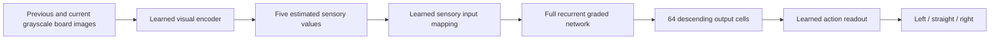

# How the model works

The connectome supplies neuron identities, directed connectivity, and integer synapse counts. Physiology, visual encoding, learning rules, and the connection between the network and Snake are modelling choices.



## Inputs and decisions

Two consecutive 16 × 16 grayscale images supply visual context. A symmetry-aware encoder uses eight rotated/reflected views and produces estimates of food direction and nearby obstacles. A frozen learned mapping projects five estimates onto sensory neurons. The action readout uses 64 neural outputs to choose among three relative actions.

Training used demonstrations and additional development corrections. Teacher actions and privileged training targets are absent from inference. There is no runtime safety filter choosing actions in the displayed games.

## Neural dynamics

The selected full network has 165,122 neurons and 25,563,197 measured directed pairs. Each 10 ms numerical substep updates a continuous signed state using:

```text
h_next = 0.5 h + 0.5 tanh(W h + input)
```

Ten substeps make a 100 ms decision window. `W` combines measured integer synapse counts, assumed signed physiology, normalization/stability scaling, and learned positive efficacies on eligible connections. The anatomical pair list and measured counts remain fixed. The numerical implementation is in [`full_core_v88.py`](../model/snake_whole/full_core_v88.py).

This is graded activity, not a spiking model. Transmitter annotations and assigned excitatory/inhibitory signs are separate from the current sign of a cell's state. An annotation such as “dopamine” does not imply that the complete biological neuromodulatory mechanism is implemented.

## What the viewer records

The public games contain all-cell states at each 100 ms decision endpoint. The underlying model takes 10 ms substeps, but intermediate states are not included in these two replays. Values hold until the next recorded sample.

At a completed decision the large board shows the result, while the input panel retains the images that preceded that action. Both use the same decision index. Connection lines describe anatomical links; they are not measured signal trajectories. Cell colours, display contrast, and history zoom do not modify the values.

141,000 cells have measured soma/root locations. The remaining 24,122 have no invented 3D coordinates and can be selected in the grid or inspector.

## Interpretation

Simulating all cells does not prove that all cells or connections affect useful behaviour. That requires interventions and comparisons. This project establishes an interactive engineering demonstration with real anatomical constraints, not a validated reconstruction of fly cognition. See [results and deferred validation](results.md).
